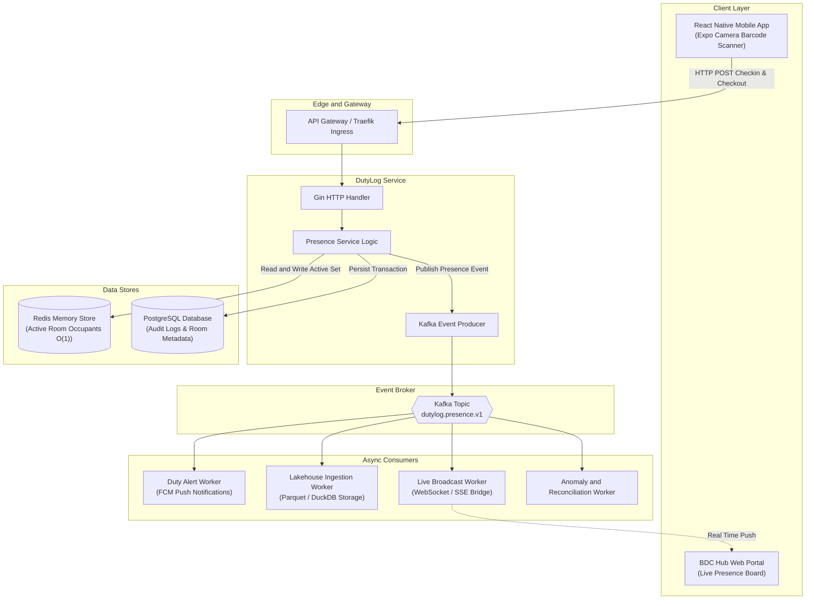

# DutyLog System Architecture

Owner: BDC Dev Team  
Version: 1.0.0  
Status: Approved  

---

## 1. Architectural Philosophy

DutyLog decouples the immediate user experience from downstream business logic using a dual pipeline design:

1. Synchronous Critical Path: Fast, deterministic, sub 150 millisecond transaction path delivering instant confirmation, audio chime, and haptic feedback to students scanning cards at the room entrance.
2. Asynchronous Event Driven Path: Apache Kafka streaming pipeline delivering durable event distribution for notification dispatch, analytical storage ingestion, and live administrative dashboard synchronization.

---

## 2. High Level Component Architecture



---

## 3. Synchronous Critical Path Design

When a student arrives at Room 605 C6, 303 B9, or 710 H6, the mobile application scans the student card barcode using native camera hardware.

### Latency Budget (Target: under 150 milliseconds)

* Barcode Frame Recognition: 30 milliseconds (on device edge inference).
* Network Transit: 40 milliseconds (mobile cellular or campus Wi Fi).
* Gateway and Service Routing: 10 milliseconds.
* PostgreSQL Transaction Write: 25 milliseconds (append only log).
* Redis In Memory Set Insertion: 2 milliseconds.
* HTTP Response Transit: 30 milliseconds.
* Total Latency: approximately 137 milliseconds.

### In Memory Data Structures (Redis)

To facilitate instantaneous occupancy queries without loading the relational database, active presence is maintained inside Redis data structures:

* Key: `dutylog:room:{room_id}:active`
* Type: Sorted Set (ZSET)
* Member: `{student_id}:{student_name}:{entry_method}`
* Score: Epoch millisecond timestamp of check in

Operations:
* Check In: `ZADD dutylog:room:{room_id}:active {timestamp} {member_payload}`
* Check Out: `ZREM dutylog:room:{room_id}:active {member_payload}`
* Query Occupancy: `ZRANGEBYSCORE dutylog:room:{room_id}:active -inf +inf` (Completes in O(log N + M) where N is small, typically under 50 occupants).

---

## 4. Asynchronous Event Pipeline Design

Every entry and exit emits an immutable domain event to Apache Kafka topic `dutylog.presence.v1`.

### Event Payload Schema

```json
{
  "event_id": "evt_01J8N29M09Q7P9X",
  "event_version": "1.0",
  "event_type": "CHECK_IN",
  "organization_id": 1,
  "room_id": "CS1-605-C6",
  "student_id": "2112345",
  "student_name": "Nguyen Van A",
  "duty_assigned": true,
  "timestamp": "2026-09-15T13:45:00Z",
  "client_metadata": {
    "device_platform": "android",
    "scan_method": "BARCODE_CODE128",
    "offline_cached": false
  }
}
```

### Specialized Consumers

1. Duty Alert Worker:
   * Compares incoming check in events against the scheduled duty shifts for the active time window.
   * If a scheduled shift has no check in recorded after 15 minutes, an automated push notification alert is routed to club leadership.
   * Alerts the active duty personnel 10 minutes prior to shift completion.

2. Lakehouse Ingestion Worker:
   * Consumes all presence events into the BDC Data Lakehouse platform.
   * Stores records in Parquet columnar format partition by year, month, and organization.
   * Enables historical analytics, shift attendance percentages, and member participation metrics.

3. Live Broadcast Worker:
   * Pushes lightweight JSON updates over Server Sent Events or WebSockets to the BDC Hub administrative portal.
   * Allows leadership to observe room occupancy changes live without polling.

4. Offline Reconciliation Worker:
   * Handles replayed scan batches uploaded after network reconnection.
   * Resolves duplicate entries using event timestamps and sequence validation.
